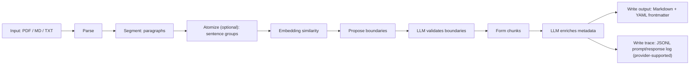
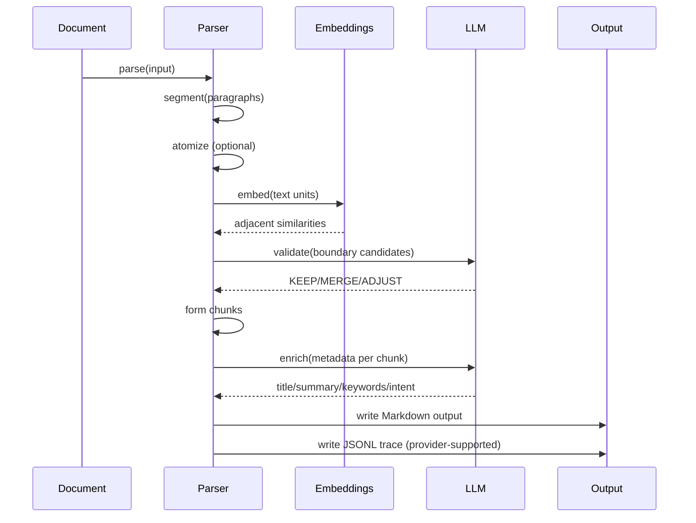

# Scalpel

Semantic document chunking for retrieval (RAG), search, and downstream analytics.

Scalpel transforms unstructured documents (PDF, Markdown, plain text) into semantically isolated chunks enriched with structured metadata. It is built as a composable pipeline with pluggable embedding + LLM providers and enterprise-friendly observability (including prompt/response traces when supported by the provider).

## What You Get

- Retrieval-first chunk boundaries (topic purity over broad grouping)
- PDF-aware segmentation (handles "long paragraph" extraction realities)
- Metadata enrichment per chunk (title, summary, intent, keywords)
- Deterministic, inspectable pipeline stages with metrics
- LLM trace logs (what was sent to the model and what came back, when supported)

## Supported Inputs

- PDF (PyMuPDF)
- Markdown
- Plain text (`.txt`, `.text`)

## Installation

```bash
pip install scalpel
```

From source:

```bash
git clone https://github.com/your-org/scalpel.git
cd scalpel
pip install -e .
```

## Quick Start

```python
from scalpel import Scalpel

scalpel = Scalpel(
    openai_api_key="sk-...",
    model="gpt-4o",
)

result = scalpel.chunk(
    input_file="document.pdf",
    output_dir="./output",
)

print("chunks:", result.chunk_count)
print("output:", result.output_path)
```

## How Chunking Works (Step-by-Step)





### Stage Outputs

1. Parse
   - Produces a `Document` with sections, paragraphs, and raw text.
2. Segment
   - Extracts ordered `Paragraph` items in document order.
3. Atomize (optional)
   - Splits long paragraphs into smaller sentence groups before boundary detection.
   - This is especially important for PDFs where extraction often collapses multiple ideas into a single "paragraph."
4. Boundary detect (embeddings)
   - Computes semantic similarity between adjacent paragraph/atom embeddings.
   - Proposes boundaries where similarity drops below `similarity_threshold`.
5. Boundary validate (LLM)
   - Validates each proposed boundary for retrieval quality:
     - `KEEP` (split is correct)
     - `MERGE` (should be continuous)
     - `ADJUST` (boundary should move nearby)
6. Chunk form
   - Groups paragraphs/atoms into chunks using final boundaries.
7. Enrich (LLM)
   - Extracts structured metadata per chunk.
8. Output
   - Writes chunked Markdown and provider-supported JSONL debug traces.

## Output Format

Each chunk is emitted as Markdown with YAML frontmatter:

```markdown
---
chunk_id: chunk_001
title: Example Chunk Title
summary: 1-2 sentence summary of the chunk.
intent: explains
keywords:
- keyword1
- keyword2
parent_section: Some Section
token_count: 58
---

Chunk content goes here...
```

## Reference: PDF Example (Distributed 12-Topic Test)

This repository uses a regression-style PDF designed to test topic separation when concepts are related but intentionally distributed.

### Input Reality (PDF Parsing)

PDF extraction commonly yields a small number of long paragraphs (even when the source document is conceptually separated). Without additional processing, that limits the maximum number of chunk boundaries.

Scalpel's `atomize` stage addresses this by splitting long paragraphs into smaller sentence groups before boundary detection.

```text
Distributed_12_Topic_Semantic_Document.pdf
  -> extracted paragraphs: 7
  -> atomized sentence groups: 21
  -> final semantic chunks: 14
```

### Example Output: 14 Chunks

Below is an example chunk set produced from `Distributed_12_Topic_Semantic_Document.pdf` (titles + token counts taken from generated output):

| Chunk | Title | Intent | Tokens |
| --- | --- | --- | --- |
| chunk_001 | Organizational Mobility Framework | explains | 102 |
| chunk_002 | Financial Planning in Workforce Mobility | explains | 35 |
| chunk_003 | Financial Discipline in Vendor Management | explains | 59 |
| chunk_004 | Employee Transition Support Policies | explains | 64 |
| chunk_005 | Relocation Success Factors | explains | 24 |
| chunk_006 | Domestic vs International Mobility Programs | compares | 36 |
| chunk_007 | Mitigating Compliance and Tax Communication Risks | warns | 27 |
| chunk_008 | Cross-Border Workforce Planning Risks | explains | 24 |
| chunk_009 | Employee Responsibility in Relocation | explains | 57 |
| chunk_010 | Promoting Accountability and Transparency | explains | 19 |
| chunk_011 | Change Management in Relocation Programs | explains | 32 |
| chunk_012 | Effective Communication in Organizational Change | explains | 45 |
| chunk_013 | Relocation Data Tracking and Improvement | explains | 57 |
| chunk_014 | Importance of Data in Mobility Programs | explains | 21 |

### Topic Coverage Map

| Semantic area (PDF) | Chunk IDs |
| --- | --- |
| Governance + eligibility | chunk_001 |
| Financial planning | chunk_002 |
| Vendor management | chunk_003 |
| Housing assistance + settling-in services | chunk_004, chunk_005 |
| International compliance + tax treatment | chunk_006, chunk_007, chunk_008 |
| Employee responsibility + repayment obligations | chunk_009, chunk_010 |
| Change management + communication strategy | chunk_011, chunk_012 |
| Data tracking + continuous improvement | chunk_013, chunk_014 |

## Configuration

### Granularity Controls

- `similarity_threshold`
  - Lower values propose fewer boundaries.
  - Higher values propose more boundaries.
- `atomize_sentences_per_paragraph`
  - If > 0, long paragraphs can be split into sentence groups before boundary detection.
- `atomize_min_sentences`
  - Only atomize paragraphs that meet or exceed this sentence count.

### YAML Example

```yaml
# scalpel.yaml
chunking:
  similarity_threshold: 0.5
  atomize_sentences_per_paragraph: 2
  atomize_min_sentences: 6

behavior:
  retry_attempts: 2
  fallback_enabled: true
  continue_on_error: false
  verbose: false

llm:
  model: gpt-4o
  temperature: 0.1
```

## LLM Trace Logging (Prompt/Response Audit)

When using the built-in OpenAI-compatible provider, Scalpel writes a JSONL trace file in the output directory:

- `Scalpel_llm_debug_<input_stem>_<utc_timestamp>.jsonl`

Each `llm_call` record includes:

- `prompt`
- `system_prompt`
- `response`
- `tokens_used`
- `success` / `error`

Example record:

```json
{
  "type": "llm_call",
  "run_id": "MyDoc_20260205_001122",
  "timestamp": "2026-02-05T00:11:22.000000+00:00",
  "prompt": "...",
  "system_prompt": "...",
  "response": "...",
  "tokens_used": 452,
  "success": true,
  "error": null
}
```

Security note: these logs can contain sensitive document content. Store and handle them accordingly.

## Metrics and Observability

Each `chunk(...)` call returns a `ScalpelResult` that includes:

- `chunks` and `output_path`
- `warnings` / `errors`
- `metrics` (stage timings and counts)

Common metric keys:

- `parse_time`, `segment_time`, `atomize_time`, `boundary_detect_time`, `boundary_validate_time`, `enrich_time`, `output_time`, `total_time`
- `paragraph_count`, `paragraphs_before_atomize`, `paragraphs_after_atomize`
- `boundary_proposals_count`, `boundaries_kept`, `boundaries_merged`

## Security and Data Handling

- Scalpel processes documents locally for parsing and embedding generation (Sentence Transformers by default).
- Chunk metadata enrichment and boundary validation send text to the configured LLM endpoint.
- Trace logs write prompt/response content to disk; treat output directories as sensitive data stores.

## CLI

```bash
# Basic usage
scalpel document.pdf -o ./output --verbose

# Dry run (no LLM calls)
scalpel document.md -o ./output --dry-run
```

## Provider Interop (OpenAI-Compatible Endpoints)

Scalpel can be pointed at OpenAI-compatible gateways (example: Groq) by using `base_url`:

```python
import os
from scalpel import Scalpel, ScalpelConfig
from scalpel.llm import OpenAIProvider

llm = OpenAIProvider(
    api_key=os.environ["GROQ_API_KEY"],
    base_url="https://api.groq.com/openai/v1",
    model="llama-3.3-70b-versatile",
)

scalpel = (
    Scalpel.builder()
    .with_config(ScalpelConfig(verbose=True))
    .with_llm_provider(llm)
    .build()
)

result = scalpel.chunk("document.pdf", output_dir="./output")
```

## Extending Scalpel

### Custom Parser

```python
from scalpel.parsers.base import DocumentParser
from scalpel.parsers import ParserFactory

class DocxParser(DocumentParser):
    def supported_extensions(self):
        return [".docx"]

    def parse(self, file_path):
        ...

ParserFactory.register(".docx", DocxParser)
```

### Custom LLM Provider

```python
from scalpel.llm.base import LLMProvider, LLMResponse

class CustomProvider(LLMProvider):
    @property
    def model_name(self) -> str:
        return "custom-model"

    def complete(self, prompt: str, system_prompt=None) -> LLMResponse:
        ...

    def complete_json(self, prompt: str, system_prompt=None) -> dict:
        ...
```

## License

Apache License 2.0

## Key Dependencies

- `pymupdf` (PDF parsing)
- `markdown-it-py` (Markdown parsing)
- `sentence-transformers` (embeddings)
- `openai` (OpenAI-compatible LLM calls)
- `tiktoken` (token counting)
